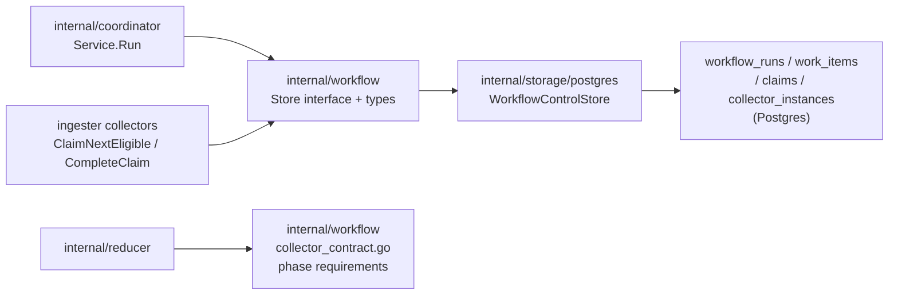
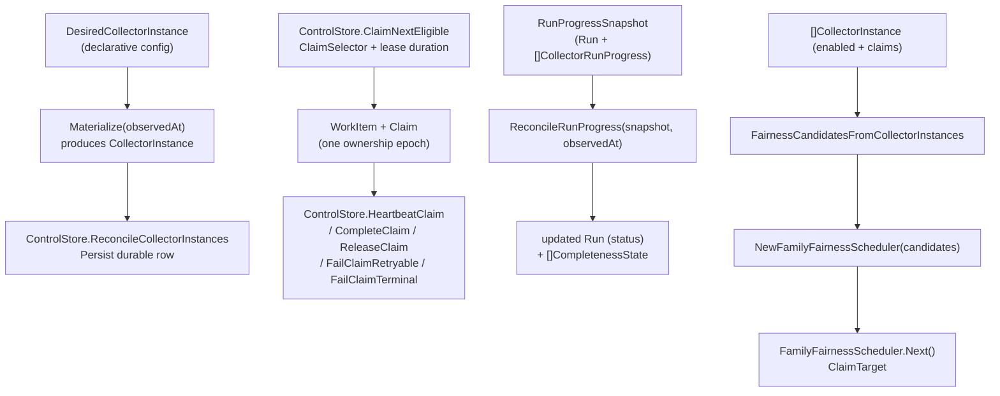

# Workflow

## Purpose

`internal/workflow` defines the durable contracts for the workflow control
plane: runs, work items, claims, collector instances, completeness states, the
`ControlStore` surface, and the reducer-facing phase contract per collector
family. All types are storage-neutral value types with `Validate` methods;
this package never opens database connections.

## Where this fits in the pipeline

## Internal flow

## Lifecycle / workflow

Types in this package flow through four phases of the workflow control plane:

1. **Collector registration** — `DesiredCollectorInstance` represents declarative
   configuration. `Materialize(observedAt)` binds it to a timestamp and produces
   a `CollectorInstance` suitable for `ControlStore.ReconcileCollectorInstances`.

2. **Work intake** — a caller creates a `Run` and calls
   `ControlStore.EnqueueWorkItems` with a slice of `WorkItem` rows. Each
   `WorkItem` carries identity (`WorkItemID`, `RunID`, `CollectorKind`,
   `CollectorInstanceID`), a `FairnessKey` for cross-instance routing, and a
   `WorkItemStatus` lifecycle value. Terraform-state work is planned before the
   state file is opened, so its initial `GenerationID` and `SourceRunID` use a
   candidate planning ID. The collector replaces that planning identity with the
   real state generation after reading the state serial and lineage.

3. **Claim lifecycle** — collector actors call `ControlStore.ClaimNextEligible`
   with a `ClaimSelector` to acquire a `WorkItem` and `Claim`. They advance the
   claim via `HeartbeatClaim`, `CompleteClaim`, `ReleaseClaim`,
   `FailClaimRetryable`, or `FailClaimTerminal` using a `ClaimMutation` carrying
   the `FencingToken` for optimistic concurrency. The coordinator's
   `ControlStore.ReapExpiredClaims` reclaims ownership of claims whose
   `LeaseExpiresAt` has passed.

4. **Run progress and completeness** — reducer phases publish checkpoints that
   the coordinator observes. `ReconcileRunProgress(snapshot, observedAt)` takes
   a `RunProgressSnapshot` (a `Run` plus per-collector counts and published phase
   counts) and derives an updated `Run.Status` and a sorted slice of
   `CompletenessState` rows. Terminal collector failures produce blocked
   completeness rows before downstream phases can be marked ready. The
   transition table:

   | Condition | `RunStatus` |
   |---|---|
   | any `failed_terminal` work items | `failed` |
   | all collection complete + all required phases ready | `complete` |
   | all collection complete, some phases pending | `reducer_converging` |
   | any claimed or mix of pending/completed | `collection_active` |
   | no collectors yet | `collection_pending` |

## Exported surface

**Status enums** (all carry `Validate` methods):
- `CollectorMode` — `continuous`, `scheduled`, `manual`
- `TriggerKind` — `bootstrap`, `schedule`, `webhook`, `replay`,
  `operator_recovery`
- `RunStatus` — `collection_pending`, `collection_active`,
  `collection_complete`, `reducer_converging`, `complete`, `failed`
- `WorkItemStatus` — `pending`, `claimed`, `completed`, `failed_retryable`,
  `failed_terminal`, `expired`
- `ClaimStatus` — `active`, `completed`, `failed_retryable`,
  `failed_terminal`, `expired`, `released`

**Durable value types** (all carry `Validate` methods):
- `Run` — root record for one workflow execution
- `WorkItem` — bounded collector slice unit; carries `FencingToken` and
  `CurrentClaimID`
- `Claim` — one ownership epoch for a `WorkItem`; carries `FencingToken` for
  safe concurrent mutation
- `DesiredCollectorInstance` — declarative config shape; `Materialize` binds to
  a timestamp
- `CollectorInstance` — durable row; adds `LastObservedAt`, `DeactivatedAt`
- `CompletenessState` — one reducer-phase checkpoint row per collector kind per
  keyspace per phase

**Store surface**:
- `ControlStore` — the full durable surface (thirteen methods) implemented by
  `storage/postgres`
- `ClaimSelector`, `ClaimMutation`, `ClaimedWorkItem` — claim operation
  arguments and return shapes
- `ClaimMutation.Resolved*` — optional completion-time phase identity fields
  used when planned work cannot know the final reducer checkpoint tuple until
  source open. Terraform-state claims use these fields to replace candidate
  planning IDs with the real snapshot scope/generation before reconciliation.

**Phase contract**:
- `CollectorContract`, `CollectorContractFor`, `CanonicalKeyspacesForCollector`,
  `RequiredPhasesForCollector` — lookup table of required reducer phases per
  collector family; registered entries: `CollectorGit`,
  `CollectorTerraformState`, `CollectorAWS`, `CollectorWebhook`,
  `CollectorDocumentation`, `CollectorOCIRegistry`
- `PhaseRequirement`, `PhasePublicationKey` — per-phase requirement and
  publication checkpoint key types

**Run progress**:
- `CollectorRunProgress`, `RunProgressSnapshot` — inputs to `ReconcileRunProgress`
- `ReconcileRunProgress(snapshot, observedAt)` — pure derivation of `Run` status
  and completeness rows
- `CompletenessStatusPending`, `CompletenessStatusReady`,
  `CompletenessStatusBlocked` — status constants

**Fairness scheduling**:
- `FairnessCandidate`, `ClaimTarget` — input and output of the scheduler
- `FamilyFairnessScheduler`, `NewFamilyFairnessScheduler` — deterministic
  weighted round-robin across collector families; rotation within each family
- `FairnessCandidatesFromCollectorInstances` — extracts claim-enabled durable
  instances into `FairnessCandidate` slices

`DesiredCollectorInstance.Validate` applies a stricter configuration check for
`terraform_state` instances. A Terraform state collector must declare a
`discovery` block with graph discovery, explicit seeds, or local repo limits.
S3 seeds must include bucket, key, and region; any S3 seed also requires
`aws.role_arn`. This keeps unsafe or incomplete state-reader config out of the
durable `collector_instances` table.

`oci_registry` collector instances are claim-capable. The coordinator plans one
bounded work item per configured registry repository target, and the
`collector-oci-registry` runtime resolves each claimed `scope_id` back to a
configured target before scanning. OCI registry instances still declare no
reducer phase requirements until registry facts have a graph projection
contract.

`package_registry` collector instances are claim-capable. The coordinator plans
one bounded work item per configured package/feed target, and the
`collector-package-registry` runtime resolves each claimed `scope_id` back to a
configured metadata endpoint before parsing package-native evidence. Targets
may opt into `document_format=artifactory_package` when the response is a
JFrog wrapper around native metadata; unknown document formats are rejected
before planning. Targets may also opt into `derive_from_owned_packages` for
bounded npm package metadata planning from active owned Git dependency facts.
Package registry instances are fact-only until reducer correlation and graph
projection contracts land.

`vulnerability_intelligence` collector instances are claim-capable. The
coordinator plans one bounded work item per configured vulnerability source
target. When `derive_from_owned_packages.enabled=true`, the planner can derive
OSV npm package-version targets from active owned dependency facts only when
the dependency carries an exact version. Manifest ranges, aliases, workspace
references, file/git references, and `latest` remain partial evidence and are
not promoted into OSV package-version collection targets.

`aws` collector instances are claim-capable. The coordinator plans one bounded
work item per authorized `(account_id, region, service_kind)` tuple, and the
`collector-aws-cloud` runtime commits durable facts such as `aws_resource`,
`aws_relationship`, `aws_tag_observation`, and `aws_warning` for each claim,
and updates `aws_scan_status` rows for the scanner status/read model. AWS
workflow completion is fact-backed in the current runtime: the cloud-resource
graph projection and DSL anchor contracts are scaffolded, but no live runtime
publishes `cloud_resource_uid` phase rows yet. Do not require those phases for
AWS workflow-run completion until the cloud-resource graph writer and anchor
publisher are implemented and wired.

**Defaults**:
- `DefaultClaimLeaseTTL()` — 60s
- `DefaultHeartbeatInterval()` — 20s
- `DefaultReapInterval()` — 20s
- `DefaultExpiredClaimLimit()` — 100
- `DefaultExpiredClaimRequeueDelay()` — 5s

## Dependencies

- `internal/reducer` — `GraphProjectionKeyspace` and `GraphProjectionPhase`
  identifiers used in the phase contract and `CompletenessState`
- `internal/scope` — `CollectorKind` used throughout

## Telemetry

None. The coordinator (`internal/coordinator`) and storage
(`internal/storage/postgres`) layers own telemetry around these contracts.

## Operational notes

- `ReconcileRunProgress` is a pure function. Feed it a fresh
  `RunProgressSnapshot` from the store and compare the returned `Run.Status`
  to the current durable row to determine whether an update is needed.
- `CollectorRunProgress.PublishedPhaseCounts` must be keyed by
  `PhasePublicationKey` values from `RequiredPhasesForCollector`. A missing key
  counts as zero published items and keeps the phase in `pending`.
- Terraform-state readiness follows `internal/reducer/tfstate` and currently
  requires only the `terraform_resource_uid` and `terraform_module_uid`
  `canonical_nodes_committed` checkpoints. `cross_source_anchor_ready` belongs
  to the DSL layer and must not be required for Terraform-state run completion
  unless that runtime starts publishing it.
- AWS readiness currently has no operational workflow completeness phases. The
  `internal/reducer/aws` package is scaffold-only; until a live AWS reducer or
  projector publishes `cloud_resource_uid` phase rows, completed AWS workflow
  work items must not wait on those future checkpoints.
- `CompletenessState` rows from `ReconcileRunProgress` are sorted by
  `CollectorKind`, `Keyspace`, `PhaseName` — callers can compare slices
  element-by-element for drift detection.

No-Regression Evidence: the Terraform-state workflow completion fix is covered
by
`go test ./internal/workflow ./internal/collector ./internal/collector/tfstateruntime ./internal/storage/postgres -run 'TestRequiredPhasesForCollectorMatchesTerraformStateReducerContract|TestClaimedServiceCompletesUnchangedTerraformStateClaimWithoutCommit|TestClaimedServiceCompletesTerraformStateClaimWithResolvedProjectionIdentity|TestClaimedSourceCompletesS3NotModifiedCandidateWhenPriorGenerationKnown|TestWorkflowControlStoreIntegrationCompleteClaimCanResolveProjectionIdentity' -count=1`.
The Postgres identity mutation was also exercised with
`ESHU_POSTGRES_DSN=postgres://... go test ./internal/storage/postgres -run TestWorkflowControlStoreIntegrationCompleteClaimCanResolveProjectionIdentity -count=1 -v`
against a throwaway Postgres container.
The test set proves the phase contract matches the reducer-owned Terraform
state checkpoints, candidate-scoped claims complete with the real snapshot
identity, S3 not-modified claims carry prior-generation identity, and Postgres
stores the resolved phase tuple under the same claim fence. It changes no
worker counts, claim ordering, scan cardinality, graph writes, or NornicDB
settings.

Observability Evidence: no new metrics were required. Existing workflow-run
status, workflow completeness rows, workflow work-item identity columns,
claim-fence mutation errors, `/api/v0/index-status`, and the remote runtime
state gate expose whether Terraform-state claims are still collecting,
completed, blocked, or stuck in reducer convergence.

No-Regression Evidence: `go test ./internal/workflow -run 'TestReconcileRunProgressCompletesAWSWithoutImplementedGraphPhases|TestCollectorContractForAWSHasNoOperationalGraphReadinessUntilProjectionLands' -count=1`
proves completed AWS collector work reaches terminal workflow status without
waiting on unimplemented `cloud_resource_uid` graph phase rows. The change does
not alter claim ordering, AWS scan fan-out, fact commit shape, reducer queue
claiming, worker counts, graph writes, or NornicDB settings.

Observability Evidence: no new metrics were required. Existing
`workflow_runs`, `workflow_work_items`, `aws_scan_status`,
`eshu_dp_aws_resources_emitted_total`, `eshu_dp_aws_relationships_emitted_total`,
`eshu_dp_aws_tag_observations_emitted_total`, AWS runtime-drift reducer logs,
and `/api/v0/index-status` separate collector completion, fact emission, scan
health, drift read-model publication, and future graph-readiness gaps.

No-Regression Evidence: the owned package target derivation contract is covered
by `go test ./internal/coordinator ./internal/workflow ./internal/storage/postgres ./internal/collector/packageregistry/packageruntime ./internal/collector/vulnerabilityintelligence/vulnruntime ./cmd/workflow-coordinator ./cmd/collector-package-registry ./cmd/collector-vulnerability-intelligence -count=1`.
The test set proves package-registry planning derives unique npm metadata
targets from active owned package evidence, vulnerability planning derives OSV
targets only for exact owned npm versions, range and alias dependencies stay
out of exact vulnerability collection, the coordinator passes active owned
dependency rows to both planners, and both hosted collector commands parse the
new derivation config. Planning remains bounded by
`derive_from_owned_packages.target_limit` with a default cap of 100 derived
targets and does not change worker counts, claim leases, graph writes, reducer
queues, or NornicDB settings.

Observability Evidence: no new metrics were required. Existing workflow run
rows, work-item rows, `requested_scope_set` payloads, coordinator reconcile
metrics, collector claim status, package-registry request/fact/rate-limit
metrics, vulnerability-intelligence observation/fetch/fact metrics, and
`/api/v0/index-status` expose planned, skipped, rate-limited, failed, completed,
and stuck target states without putting package names, versions, feed URLs, or
credential material in metric labels.

## Extension points

- **Add a new collector family** — add an entry to `collectorContracts` in
  `collector_contract.go` with the required `PhaseRequirement` rows. The
  coordinator and storage layers consume the contract via
  `RequiredPhasesForCollector` lookups; no changes to their code are needed.
- **Add a new `RunStatus` transition** — edit `ReconcileRunProgress` in
  `progress.go`; add the new `RunStatus` constant in `types.go` with a
  `Validate` entry; update `progress_test.go` coverage.
- **Add a new claim operation** — add the method to `ControlStore` in
  `store.go`; implement it in `storage/postgres`; no changes to the value types
  are needed unless the operation introduces new state.

## Gotchas / invariants

- Every `Validate` enforces non-blank identifiers, known status enum values,
  and `updated_at >= created_at`. Stored rows that fail `Validate` should be
  treated as corruption and not silently ignored.
- `FamilyFairnessScheduler.Next` mutates internal `currentWeight` state. A
  single scheduler instance is not safe for concurrent use without external
  synchronization.
- Adding a new collector family requires an entry in `collectorContracts` in
  `collector_contract.go`. The lookup returns `false` for unknown kinds;
  callers that do not check will silently get empty phase lists.
- `DesiredCollectorInstance.Materialize` always sets `CreatedAt` and
  `UpdatedAt` to the supplied `observedAt`. The storage layer is responsible
  for applying an upsert that preserves the original `CreatedAt` on repeat
  calls.
- `ReconcileRunProgress` returns `RunStatusCollectionPending` for a snapshot
  with no collectors, not an error. An empty `Collectors` slice is valid
  (early in run lifecycle).

## Related docs

- `docs/public/architecture.md`
- `docs/public/deployment/service-runtimes.md`
- `go/internal/coordinator/README.md`
- `go/internal/storage/postgres` — the Postgres WorkflowControlStore type
  implements `ControlStore`
